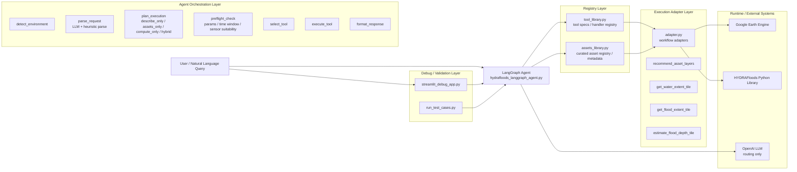
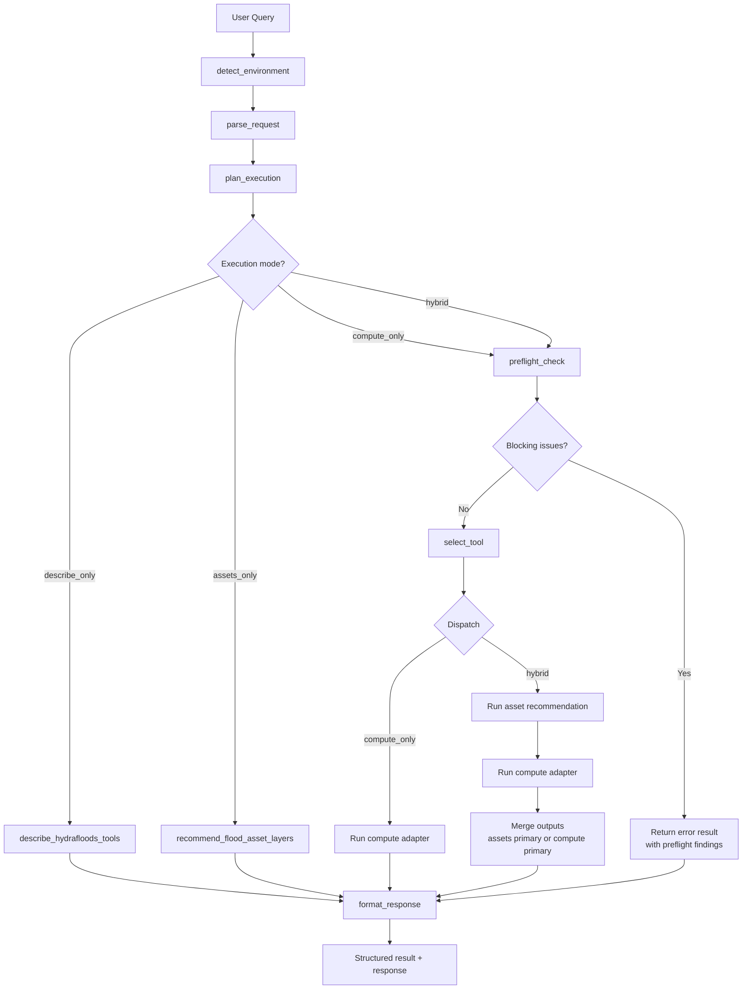

# HYDRAFloods Agent Architecture

This document reflects the current design of the `experiment/hydrofloods` agent after introducing:

- explicit execution planning
- preflight validation before execution
- asset recommendation as an independent early-stage decision
- separation between registry, adapter, and orchestration responsibilities

## Layered Architecture

## Runtime Graph

## Execution Modes

The agent now plans execution explicitly before any tool runs.

### `describe_only`

- Used for capability and tool-library questions.
- No asset rendering.
- No HYDRAFloods computation.

### `assets_only`

- Used when the user wants data-product recommendation or reference layers only.
- Returns recommended asset layers.
- Does not run HYDRAFloods computation.

### `compute_only`

- Used when the user asks for a direct HYDRAFloods analysis result.
- Runs one compute adapter only.
- Does not attach recommendations automatically.

### `hybrid`

- Used when the query asks for both recommendation/context and fresh computation.
- Runs recommendation first, then compute.
- Keeps a declared primary output:
  - `assets`
  - `compute`

## Preflight Responsibilities

Preflight runs before real execution for compute and hybrid flows.

Current checks include:

- missing required parameters
- requested time window versus asset availability
- sensor suitability warnings

Examples:

- optical flood extent warns about cloud/shadow risk
- depth estimation warns when the chosen sensor is not ideal
- Sentinel-1 water mapping warns that thresholding may be unstable

## Module Responsibilities

### `hydrafloods_langgraph_agent.py`

- routing
- execution planning
- preflight validation
- dispatch
- response formatting

### `tool_library.py`

- tool catalog for the agent
- handler registration
- tool descriptions and intent mapping

### `assets_library.py`

- curated asset registry
- runtime overrides
- recommendable asset filtering
- asset metadata used in recommendation and rendering

### `adapter.py`

- execution harness for HYDRAFloods workflows
- asset layer rendering
- structured result generation
- map artifacts, legends, metadata, and repro code

### `streamlit_debug_app.py`

- manual testing shell for the latest agent structure
- map and legend inspection
- recommendation inspection
- raw-state debugging

### `run_test_cases.py`

- regression checks for routing and execution behavior
- token accounting
- report generation

## Design Boundary

The current design intentionally keeps these concerns separate:

- orchestration stays in the LangGraph layer
- tool registration stays in the tool library layer
- actual workflow execution stays in the adapter layer
- curated asset selection stays in the assets library layer

This avoids treating HYDRAFloods compute tools as if they were data-product recommendations.
