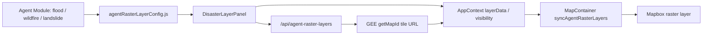

# SatGPT Agent 模式默认图层扩展报告

生成时间：2026-06-09 22:21  
项目路径：`E:\GMS\Flood\SatGPT-app`

## 1. 结论摘要

本次改造目标不是新增完整的灾害 Agent，而是先把 Agent 模式下的默认图层体系扩展成可复用结构，让 Flood、Wildfire、Landslide 三类模块都能共享同一套图层管理逻辑。

核心结论：

- Imagery 可以复用：继续使用 Agent 已有的 Sentinel-2 / Sentinel-1 影像开关逻辑。
- Vector 可以复用：继续使用已有 `businessLayers` 空间范围管理逻辑。
- Raster 可以半复用：UI、状态、Mapbox 渲染链路可以复用，但每个灾种需要配置自己的 raster key 和后端 GEE tile 生成逻辑。
- Wildfire 已接入 3 个默认 raster：Active Fire Detections、Population Exposure、Fuel / Land Cover。
- Landslide 已接入 3 个默认 raster：Slope Steepness、Population Exposure、Land Cover Context。
- Burn Severity、Fire Weather Index 没有假装完成，仍保留为后续待接入能力，因为它们需要明确的日期契约或模型服务。

一句话讲给师兄：

> 这次不是重写 Agent，而是把“图层管理”从 Flood 专属逻辑抽成模块化能力。影像和矢量完全复用，栅格图层通过配置和后端 key 扩展，已经验证 Wildfire 和 Landslide 都能走同一条 GEE tile 渲染链路。

## 2. 改造前的问题

原先 Agent 模式的图层体系基本是 Flood-oriented：

```text
Flood Agent
  ├─ AgentPanel 固定展示 Flood raster
  ├─ AppContext 只维护 Flood raster key
  ├─ MapContainer 只同步 Flood raster layer id
  └─ 后端 /api/agent-raster-layers 只认识 Flood 相关图层
```

主要问题：

1. WildfirePanel 早期只是 UI 原型，本地开关状态没有真正接入 Mapbox 和 GEE tile。
2. Raster layer key 写死在多个位置，新增灾种会导致重复改 UI、状态、地图同步、后端接口。
3. Landslide rail 原先是 disabled，无法进入模块。
4. 后端对 GEE 空 ImageCollection 没有防御，部分时间窗会触发 500。

## 3. 复用方案

本次采取的是“模块配置 + 通用图层面板 + 后端 key 扩展”的方案。



### 3.1 Imagery 复用

复用原有 Agent imagery：

- Sentinel-2 Optical Imagery
- Sentinel-1 SAR Imagery

前端仍使用：

- `agentImagery`
- `agentSelectedPeriod`
- `agentShowBaseImagery`
- `agentBaseImageryVisibility`

注意：当前 imagery 仍依赖原 Agent 影像加载结果。也就是说，如果没有先通过 Agent 流程拿到影像 tile，Wildfire / Landslide 面板会显示 imagery unavailable。这是合理边界，不应该在默认图层阶段强行伪造影像。

### 3.2 Vector 复用

Vector 复用已有 business layer 管理：

- `businessLayers`
- `toggleBusinessLayerVisibility`
- `activateBusinessLayerRecord`
- `deleteBusinessLayer`

这意味着上传、绘制、搜索得到的 AOI / spatial scope 可以直接作为 Wildfire 和 Landslide 的空间范围。

### 3.3 Raster 模块化

新增统一配置文件：

`frontend/src/config/agentRasterLayerConfig.js`

核心配置：

```js
AGENT_RASTER_LAYER_KEYS_BY_MODULE = {
  flood: [...],
  wildfire: [...],
  landslide: [...],
}
```

MapContainer 不再只认 Flood raster，而是根据当前 `agentModule` 获取当前模块的 raster keys。

## 4. 已完成模块

### 4.1 Wildfire 默认图层

| 图层 | 数据源 | 状态 | 说明 |
|---|---|---|---|
| Active Fire Detections | FIRMS / MODIS T21 | 已接入 | 支持 1-365 天检测窗口 |
| Population Exposure | CIESIN GPWv411 | 已接入 | 人口暴露背景 |
| Fuel / Land Cover | ESA WorldCover v200 | 已接入 | 燃料 / 覆盖类型背景 |
| Burn Severity | 待定 | Pending | 需要 pre-fire / post-fire 日期契约 |
| Fire Weather Index | 待定 | Pending | 需要气象风险模型接口 |

Active Fire 的一个重要解释：

> 如果 AOI 在当前时间窗内没有 FIRMS 热异常像元，地图上会是透明图层，看起来像“没有加载”。因此前端已把默认窗口从 7 天扩展到 30 天，最大可调到 365 天。

### 4.2 Landslide 默认图层

| 图层 | 数据源 | 状态 | 说明 |
|---|---|---|---|
| Slope Steepness | USGS/SRTMGL1_003 | 已接入 | 基于 SRTM 30m DEM 计算坡度 |
| Population Exposure | CIESIN GPWv411 | 已接入 | 人口暴露背景 |
| Land Cover Context | ESA WorldCover v200 | 已接入 | 地表覆盖背景 |

为什么 Landslide 第一个图层选坡度：

> 坡度不是完整滑坡易发性模型，但它是滑坡分析中最基础、最稳定、最容易解释的地形因子。相比直接找一个不确定的 landslide susceptibility 数据集，用 SRTM 30m 计算 slope 更稳，且全球覆盖、无需事件日期、后端出图风险低。

## 5. 关键代码改动

### 5.1 新增通用灾种图层面板

文件：

`frontend/src/components/DisasterLayerPanel.js`

作用：

- 统一 Raster / Imagery / Vector 三组 UI。
- 统一 AOI 检查。
- 统一调用 `/api/agent-raster-layers`。
- 统一将后端 tile 写入 `AppContext.mergeLayerData`。

Wildfire 和 Landslide 现在只是 wrapper：

```text
WildfirePanel -> DisasterLayerPanel + WILDFIRE_RASTER_LAYER_CONFIG
LandslidePanel -> DisasterLayerPanel + LANDSLIDE_RASTER_LAYER_CONFIG
```

### 5.2 新增 Landslide 面板

文件：

`frontend/src/components/LandslidePanel.js`

作用：

- 启用 Landslide 模块。
- 使用 Landslide raster 配置。
- 复用 imagery 和 vector 管理能力。

### 5.3 扩展 AppContext

文件：

`frontend/src/context/AppContext.js`

新增：

- `slopeSteepness` layerData 状态。
- `eeMapURLSlopeSteepness` normalize 映射。
- 模块切换时按当前 `agentModule` 重置 raster visibility 和 layer order。

### 5.4 扩展 MapContainer

文件：

`frontend/src/components/MapContainer.js`

改动：

- 从配置读取当前模块 raster keys。
- 切换模块时移除非当前模块的 stale raster。
- 保证 Flood / Wildfire / Landslide 不互相残留图层。

### 5.5 扩展后端 GEE tile

文件：

`agent/flood_api_services.py`

新增 key：

```python
"activeFireDetections"
"slopeSteepness"
"populationExposure"
"fuelLandCover"
```

新增 Landslide slope 构图：

```python
def _build_slope_steepness_image(region):
    elevation = ee.Image("USGS/SRTMGL1_003").select("elevation")
    return ee.Terrain.slope(elevation).rename("slope").clip(region)
```

同时修复：

- JRC 年度水体数据超出年份范围时返回透明图层，避免空 band 导致 500。
- 前端 API 错误归一化，后续能显示后端真实 `detail`，而不是只有 `Request failed with status code 500`。

## 6. 修改前后对比

### 修改前

```text
AgentPanel
  只服务 Flood

WildfirePanel
  本地 UI 原型
  开关不一定触发真实 GEE tile

Landslide
  rail disabled

MapContainer
  raster key 写死

Backend
  只认识 Flood raster
```

### 修改后

```text
DisasterLayerPanel
  通用 Raster / Imagery / Vector 图层管理

WildfirePanel
  传入 wildfire raster config

LandslidePanel
  传入 landslide raster config

MapContainer
  根据 agentModule 动态同步 raster

Backend
  支持 wildfire + landslide raster key
```

## 7. 验证结果

已完成验证：

```text
python -m py_compile agent\flood_api_services.py
npm run build
POST /api/agent-raster-layers activeFireDetections -> 200
POST /api/agent-raster-layers slopeSteepness -> 200
POST /api/agent-raster-layers slopeSteepness + populationExposure + fuelLandCover -> 200
前端切换 Wildfire / Landslide -> console error 0
```

Smoke test 截图：

```text
frontend/build/wildfire-layer-smoke.png
frontend/build/landslide-layer-smoke.png
```

## 8. 当前边界

### 8.1 Agent 逻辑没有扩展

本次只处理默认图层和图层管理，不处理真正的 wildfire / landslide agent reasoning。

当前 `CopilotKit` 仍主要绑定：

```text
flood_agent
```

所以 Wildfire / Landslide 的 chat 目前是模块说明和集成讨论，不应宣称已经具备完整执行型 Agent。

### 8.2 Landslide 不是完整易发性模型

当前 Landslide 的 `Slope Steepness` 是地形因子层，不是完整滑坡易发性结果。

如果要做正式 landslide susceptibility，至少还需要：

- 降雨触发因子
- 地质 / 岩性
- 土壤类型
- 坡向 / 曲率
- 距河流 / 道路 / 断层距离
- 历史滑坡点或训练样本
- 模型输出接口和图例契约

### 8.3 Burn Severity / Fire Weather Index 未接入

这两个 Wildfire 层没有放进可操作列表，是为了避免“能点但没有真实服务”的假完成。

## 9. 给师兄讲解的建议话术

建议按这个顺序讲：

1. 先讲目标：这次不是扩展完整 Agent，而是先把默认图层体系模块化。
2. 再讲复用判断：Imagery 和 Vector 可以直接复用，Raster 需要配置化和后端 key 扩展。
3. 展示三类模块：
   - Flood 保持原逻辑。
   - Wildfire 接入 active fire / population / land cover。
   - Landslide 接入 slope / population / land cover。
4. 强调工程收益：以后加灾种主要是加 config + 后端 GEE tile function，不再复制整套面板。
5. 最后讲边界：当前是默认图层层面，不是完整灾害模型或 Agent reasoning。

## 10. 后续建议

短期高 ROI：

- 给 Landslide 增加 Elevation / Aspect 作为第二批地形层。
- 给 Wildfire 增加 Burn Severity 的 pre/post date UI 契约。
- 把 pending 图层单独做成 “Coming Soon / Integration Gap” 区域，而不是混在可操作层中。

中期：

- 将 `flood_agent` 拆成多 module tool registry。
- 后端 `/api/agent-raster-layers` 增加 module 参数，用于更严格地控制默认 fallback keys。
- 给每个 raster layer 加 metadata：数据源、分辨率、时间范围、是否事件驱动、是否可下载。

长期：

- Wildfire：接入 burn severity、fire weather、fire perimeter。
- Landslide：接入 susceptibility model 和 rainfall trigger workflow。
- 三灾种统一成 `disaster_agent`，由 module router 分发工具和图层。

## 11. 数据源参考

- [NASA SRTM Digital Elevation 30m / USGS_SRTMGL1_003](https://developers.google.com/earth-engine/datasets/catalog/USGS_SRTMGL1_003)
- [ESA WorldCover 10m v200](https://developers.google.com/earth-engine/datasets/catalog/ESA_WorldCover_v200)
- [GPWv411 Population Density](https://developers.google.com/earth-engine/datasets/catalog/CIESIN_GPWv411_GPW_Population_Density)
